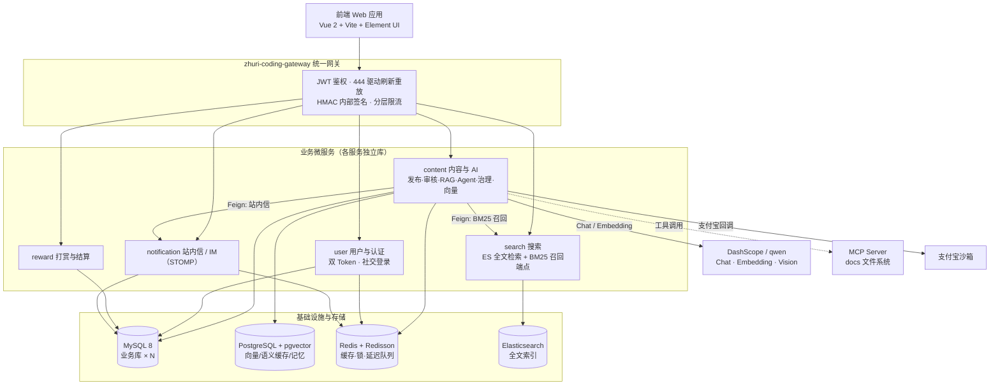

# 逐日 Coding · 内容社区与创作者变现平台

> 一个从零构建的**内容社区 + 创作者变现**平台（前后端全栈）。
> 业务侧打通「内容发布 → AI 审核 → 定时上线 → 搜索索引 → 激励 → 支付」完整闭环；
> AI 侧以同一套后端基座承载大模型应用：**RAG 社区问答、AI 发布助手（Agent + Function Calling）、内容治理与诚信体系、语义搜索与推荐、AI 成本工程**。
> 后端采用五微服务 + 统一网关架构，**单元测试 1056 例全部通过**。

<p>


</p>

---

## 目录

- [一、项目简介](#一项目简介)
- [项目预览](#项目预览)
- [二、技术栈](#二技术栈)
- [三、系统架构](#三系统架构)
- [四、核心能力](#四核心能力)
- [五、关键设计详解](#五关键设计详解)
- [六、工程质量](#六工程质量)
- [七、目录结构](#七目录结构)
- [八、本地运行](#八本地运行)
- [九、已知限制与规划](#九已知限制与规划)
- [十、作者](#十作者)

---

## 一、项目简介

面向程序员的内容社区与创作者变现平台（定位类似掘金 / 头条 / 知识付费综合体），同时是**大模型应用落地的完整实践**：

| 维度 | 内容 |
|---|---|
| **业务闭环** | 内容发布与多级审核、搜索索引、双等级激励与成就、课程购买与文章打赏、签到抽奖、站内信 IM |
| **AI 能力** | RAG 社区问答（混合召回 + 引用溯源 + 流式）、AI 发布助手（Agent 多智能体预检）、AIGC 内容诚信治理（检测 + 处置 + 申诉）、语义搜索与相似推荐、AI 商业化与成本工程 |
| **工程亮点** | 无 MQ 的 DB↔ES 最终一致、行为事件总线 + @Order 责任链、支付幂等与资损兜底、双 Token 认证与网关信任链、分层限流 |
| **架构** | 五微服务（user / content / search / reward / notification）+ 网关，各服务独立库；content 服务承载全部 AI 能力 |
| **规模** | 后端 600+ Java 文件；**1056 个单元测试全部通过**（JaCoCo 覆盖率统计） |

> 📌 本项目为**个人独立开发**项目：从需求拆分、技术选型、架构设计到编码实现与测试，全部由本人完成。各模块的设计决策与取舍（为什么用父子分块、为什么不用 MQ、支付如何防资损、一次真实时序缺陷如何定位并修复）已在下文「关键设计详解」中说明。

---

## 项目预览

> 以下为**本地全量启动后的实拍截图**（前端 Vue dev server + 后端五微服务 + 网关 + MySQL/pgvector/Redis/ES 全部运行）。
> 部分页面（AI 问答面板、成长体系、创作者中心、AI 额度包）需登录后访问，按下方「本地运行」章节启动即可自行体验。

### 首页 · 内容推荐流

内容社区主入口：分类 Tab、文章卡片（封面/标签/作者/互动数据）、每日签到、推荐话题，**右下角为 AI 问答悬浮球入口**。


### 文章详情页 · 内容 + AI 能力交汇点

整篇文章级功能：作者卡片与关注、左侧互动栏（点赞/评论/收藏/分享/举报）、文章目录、**右下角「问这篇文章」单篇 AI 问答入口**（正文即上下文、答案限本文）。


### AI 速读广场 · AI 摘要聚合页

由发布助手产出的文章摘要（已回填元数据）聚合而成的公开页，可直接阅读 AI 摘要并跳转原文。


### 搜索页 · 多维度检索

综合/文章/课程/标签/用户多 Tab 检索，支持综合排序、最新、最热与时间范围筛选；关键词命中不足时自动触发语义召回兜底。


### 登录 · 验证码 + 社交登录

手机号验证码登录（本地开发环境验证码自动填入）、密码登录，以及 **GitHub / 微博 / 微信** 三种社交登录方式。


### AI 问答面板 · 社区 AI 全量入口

登录后点击悬浮球展开：支持「快速 / 深度」两种回答模式、可溯源引用、对话记忆持久化，交互时实时展示今日免费额度与钱包余额。


### AI 额度包 · 商业化与成本工程

AI 免费额度 + 钱包余额 + 充值包三重计费体系：今日免费 2 万 tokens、按量扣减钱包、额度包（50 万 / 300 万 / 2000 万 tokens）支付宝沙箱支付购买。


### 成长体系 · 等级与行为积分

掘友分驱动的等级体系（JY1–JY8）：点赞、评论、发布、互动等行为按规则加分，页面展示当前等级、分值进度与升级行为任务列表。


### 创作者中心 · 数据仪表盘

创作者总览：数据概况卡片、创作任务（今日 0/8）、创作活动与内容数据看板，为作者提供一站式数据驾驶舱。


### 内容数据 · 单篇/整体分析

按时间范围筛选的统计卡片 + 整体分析与单篇分析，交互式图表（ECharts）与数据导出能力。


### 创作发布 · Markdown 编辑器 + AI 预检

文章发布页：标题 + 双栏 Markdown 编辑器（编辑/预览同步滚动）、导入 Markdown 文档、草稿自动保存，以及 **「AI 预检」** 一键调起多智能体发布预检（安全 / 质量 / SEO 评审，输出违规判定、质量分、推荐标签与摘要）。


### AI 发布预检报告 · 多智能体评审输出

点击发布页 **「AI 预检」** 后，由主编 Agent 编排安全 / 质量 / SEO 三个 Worker（Function Calling 并行评审）产出预检报告：违规判定、质量分（42 偏低提示优化）、技术/非技术标记、优化建议、推荐标签与一句话摘要——标签和摘要可直接点击回填到发布表单。


### 课程小册 · 知识付费与支付闭环

创作者将文章沉淀为付费小册：分类 Tab 的课程列表 → 课程详情（立即购买 / 免费试读 / 7 天无理由退款 / 目录试读锁定）→ 下单页确认订单并调起**支付宝沙箱支付**（订单号 + 应付金额 + 重新发起支付），打通「创作 → 内容 → 变现」闭环。


### 沸点广场 · 社区互动

社区轻量动态流：发布框（表情 / 图片 / 链接 / 圈子 / 话题）、最新 / 最热 / 关注三 Tab 信息流、我的圈子与推荐圈子、精选沸点与推荐话题，支撑「逐友」间的日常互动与社交关系沉淀。


### 热榜 · 实时内容排行

排行榜页：掘金热榜 Banner +「掘金文章榜 / 优质作者榜 / 文章收藏榜」三榜并立，支持按「综合 / 后端 / 前端 / Android / iOS / 人工智能 / 开发工具 / 代码人生 / 阅读」分类过滤；榜单按文章阅读量、评论数、收藏数等综合热度实时排名，与首页推荐流、搜索互为流量入口。


> 📷 **补充说明**：以上均为**本地全量启动后的实拍截图**（前端 + 五微服务 + 网关 + MySQL/pgvector/Redis/ES 全部运行）。原图存于仓库 `screenshots/` 目录，README 展示使用 **OSS 图床链接**（`material/readme/` 前缀，公网可访问、不受 GitHub 图片代理网络影响）。

---

## 二、技术栈

| 分类 | 技术 |
|---|---|
| **语言 / 运行时** | Java 17 |
| **框架** | Spring Boot 3.5.16、Spring Cloud Alibaba 2025.0.0.0（Nacos / OpenFeign / Gateway）、MyBatis-Plus |
| **AI** | **Spring AI 1.1.8**（OpenAI compatible）、qwen 系列模型（`qwen3.7-max` 强模型 + `qwen3.8-flash` 轻量模型）、DashScope Embedding（1024 维）、Function Calling、SSE 流式、MCP（Model Context Protocol） |
| **存储** | MySQL 8（业务库，分库）、**PostgreSQL + pgvector**（向量检索 / 语义缓存 / 语义记忆）、Redis + Redisson（缓存 / 分布式锁 / 延迟队列）、Elasticsearch（全文检索 + BM25 召回） |
| **支付** | 支付宝沙箱（RSA2 验签回调、幂等入账、退款兜底） |
| **前端** | Vue 2.7 + Vite 6、Element UI、Vuex / Vue Router、ECharts、bytemd（Markdown 编辑器）、阿里云 OSS 直传 |
| **可观测性** | Micrometer + Prometheus + Grafana、Zipkin（链路追踪）、Logstash Logback Encoder + Promtail |
| **测试 / 质量** | JUnit 5 + Mockito、JaCoCo |

---

## 三、系统架构



**模块职责**

| 模块 | 职责 | 数据库 |
|---|---|---|
| `zhuri-coding-gateway` | 路由、JWT 鉴权、入口限流（IP 固定窗口：普通 600/min、敏感 60/min）、HMAC 内部签名 | — |
| `zhuri-coding-service/content` | **内容 + 全部 AI 能力**（RAG 问答、发布助手 Agent、内容治理、向量与分块、语义检索、计费） | MySQL + **pgvector** + Redis |
| `zhuri-coding-service/search` | ES 全文检索，对外搜索接口 + **对内 BM25 召回端点** | Elasticsearch |
| `zhuri-coding-service/user` | 用户、双 Token 认证、社交登录（GitHub / 微博 OAuth） | MySQL |
| `zhuri-coding-service/reward` | 打赏流水、结算（课程 7:3 月度） | MySQL |
| `zhuri-coding-service/notification` | 站内信、IM（WebSocket STOMP） | MySQL |
| `zhuri-coding-{model,common,utils,feign-api}` | 实体 / 公共组件 / 工具 / Feign 契约 | — |

---

## 四、核心能力

### 4.1 AI 应用能力

#### ① RAG 社区问答（检索质量与成本工程）

用户提问 → 检索社区已发布文章 → 大模型基于资料作答，**答案带 `[n]` 引用可溯源**、SSE 逐字流式输出。

- **父子分块入库（small-to-big）**：文章切成段落级子块（目标 500 字、重叠 80 字、单篇封顶 30 块，四级降级切分：段落 → 行 → 句 → 定长硬切），每块单独向量化入 pgvector；**子块负责"被召回"（细颗粒），整篇父块负责"被阅读"（上下文完整）**——解决"一篇文章一条向量 + 正文截断"导致长文后半段召不回。
- **BM25 + 向量 RRF 混合召回**：向量路补口语化提问、BM25 路补术语 / 代码类查询（如 `@Transactional 失效场景`）；两路用 **RRF 倒数排名融合**（`score = Σ 1/(k+rank)`，k=60）——**只融合排名不融合分数**（两者量纲不可比）；任一路不可用自动退化为单路，BM25 独有命中用本地余弦补相似度（零模型调用）。
- **检索管线**：Query Rewrite（口语 → 检索式）→ 宽召回 15 篇 → LLM Rerank 精排 TopK → 按序号组装参考资料（每篇截断 1200 字符）→ 生成。
- **语义缓存**：问题向量余弦 ≥ 0.95 命中即直返历史答案，**省掉改写 / 精排 / 生成三次模型调用**；按用户隔离（答案注入了个性化上下文，跨用户复用等于泄露画像）+ **三重失效**（TTL 6h / 引用文章存活校验 / **语料内容指纹逐篇比对**）。
- **上下文预算**：召回 15 → 精排后取 topK（默认 5、上限 8）→ 每篇截断 1200 字符，最坏输入约 1.4 万字符 ≈ 7k token，**输入规模可算可控**。

#### ② AI 发布助手（Agent + Function Calling）

作者发布前点"预检"，由**主编 Agent 编排多智能体**完成评审：

- **主编（Supervisor）Agent** 运行在有界 ReAct 循环中（`maxSteps` 硬上限，主动关闭框架内部工具执行以保证步数可控），把文章拆解为**安全 / 质量 / SEO** 三位专家 Worker 任务（同一轮可并行调用，独立线程池）；
- 专家能力以 **Spring AI `@Tool` 原生 Function Calling** 暴露（框架负责 JSON Schema 协商），另注册本地确定性工具：**内容安全规则引擎**（5 类违规词表 + 14 个技术豁免词，100% 可复现、零幻觉）与 **pgvector 相似内容检索**（排除作者自身、≥0.72 预警）；
- 输出结构化预检报告：是否违规 / 违规类型 / 质量分 / 推荐标签 / 摘要 / 相似预警；
- **可扩展**：支持接入 **MCP 工具**（如文档检索、时间查询），未配置时 fail-open 不影响原有链路；
- **失败降级**：工具异常 / 未收敛 / 超步 → 回退"一次性结构化输出"，**预检失败不阻断发布**。

#### ③ 内容治理与诚信体系（自动处置 → 可纠正闭环）

- **UGC 评论治理（可靠队列）**：评论"先展示后审核"——任务落库（唯一键防重复入队）→ 延迟 5~10s 处理 → **CAS 抢占**（`WHERE status=PENDING`，天然防重复）→ 失败 **60s × 2ⁿ 指数退避**、超 5 次**降级放行**（系统故障不误删正常内容）→ 定时任务补偿崩溃恢复。红线违规物理删除；温和违规（引战 / 阴阳 / 软广）经 LLM 二次判定**折叠**（文章侧仅作者可见、沸点侧全局隐藏）。
- **AIGC 水文检测（三层漏斗）**：L1 本地四维信号快检（突发度 / 重复度 / 模板化 / 实例密度，**零模型成本**，45 触发复核、70 触发标注）→ L2 **作者历史文风向量画像**偏离度（个人基线而非全站基线，避免误伤独特文风）→ L3 LLM 复核（**判正常即纠偏清标**，宁可漏判不误伤）。
- **一处判定、多点消费**：`is_aigc` 标记驱动打赏闸门、课程禁售、向量库不入库、RAG / 搜索 / 推荐检索过滤、对外"疑似 AI 生成"角标。
- **申诉闭环**：AI 按类型复核给出"解除 / 维持"建议但**不终决**，人工终审一键解除；幂等 + **防自审护栏**（申诉人不能审自己的申诉）。

#### ④ 语义搜索与相似推荐（向量能力复用）

- **搜索**：以 ES 关键词为主，**仅当第一页命中数不足**时触发跨服务语义召回兜底（控制成本），Feign 不可用降级纯关键词、不阻断主链路；
- **相似推荐**：复用同一 pgvector 库做本文向量最近邻（无向量回退同标签），**零模型调用**；
- 一套向量基建同时服务问答检索、搜索兜底与内容推荐。

#### ⑤ AI 成本工程与商业化闭环（可衡量 → 可控 → 可变现 → 可迭代）

- **可衡量**：token 级计量统一收口在网关（**9 处模型调用接入点**，真实 usage 优先、缺失按字符估算并标记 `estimated`）；**模型路由按成本分流**——8 类高频轻量功能（改写 / 精排 / 忠实度 / 审核 / AIGC 检测 / 摘要压缩 / 申诉）走轻量模型（**成本约为强模型的 1/15**），问答生成 / 预检 / 复盘走强模型；**成本报表**按 feature × model 折算金额（含未配价模型显式提示）。
- **可控**：**LLM / Embedding 双目标熔断**（窗口内 5 次失败打开 30s，快速失败 + 半开恢复，Redis 计数多实例共享）；**SSE 客户端断开即中断生成**（取消不计熔断失败、已生成部分估算计量）+ TTFT 首 token 延迟指标。
- **可变现**：每日免费配额（Redis 计数 + **fail-open**）+ 额度包钱包（支付宝回调按订单号前缀分流、金额服务端校验、**`WHERE balance >= N` 原子扣减**防超扣）；计费口径已从"按次"升级为**按 token 成本**。
- **可迭代**：**Prompt 版本注册表**（DB 版本化 + 按用户灰度放量 + 关停即回滚 + 代码兜底 fail-open，回答携带版本号可归因）；**评测门禁**（24 条黄金问答集，recall@5 / 引用精确率 / 未溯源率 / 拒答率四阈值判定，**fail-closed**）；**反馈回灌**（差评自动导出为评测集候选 + 差评率告警）。
- **可复用**：预检产出的摘要 / 标签回填文章元数据，并复用为公开 AI 速读页（SEO 入口）。

### 4.2 业务工程能力

| 能力 | 关键设计 |
|---|---|
| **发布 → 上线 → 搜索最终一致** | Redisson 延迟队列按发布时间调度；**本地消息表单 status 状态机**（先落消息保证可补偿 → 条件更新置发布态 → 一步带发布态同步 ES）；DB 失败幂等自愈、ES 失败 20s 定时扫描重试、超限死信。**不引入 MQ** 完成双写最终一致 |
| **行为事件总线 + @Order 后置责任链** | 一次行为按类型路由，有序触发等级积分 → 文章热度 → 站内信 → 成就解锁；处理器独立降级互不拖垮；"行为记录门控 + 唯一索引"双保险防重；热度用单条原子 SQL 重算消除读改写竞态 |
| **统一支付与资损兜底** | 金额全部服务端计算；回调经 RSA2 验签 + app_id + 实付金额三重校验；**条件更新原子抢占订单状态**实现幂等入账；超时关单 + "已关单却支付成功"竞态自动退款（订单号幂等键）；结算唯一索引防重 |
| **双 Token 认证 + 网关信任链 + 分层限流** | Access 1h + Refresh 7d，刷新用 Redis Lua **原子"取即删"轮换**；社交登录（GitHub / 微博 OAuth，绑定双向防重）；网关与下游 HMAC 内部签名、下游只信网关透传身份；两层限流（网关 IP 固定窗口 + 自定义 `@RateLimit` 滑动窗口多维叠加） |

---

## 五、关键设计详解

### 5.1 为什么用父子分块 + RRF，而不是"一篇文章一条向量 + 加权融合"

**问题**：整篇一条向量会让长文语义被稀释；且生成 embedding 时截断正文，长文后半段几乎不可见。加权融合（0.7×向量 + 0.3×BM25）则需要先归一化、还要标注数据调参。

**方案**：检索粒度下沉到段落子块（`GROUP BY article_id` 取每篇最相似子块代表整篇），回答上下文仍取整篇父块；两路召回用 **RRF**——只用名次，超参只有 k，对量纲不敏感、无需训练。

**取舍（诚实）**：`MAX(相似度)` 聚合会丢掉"多块命中"的加强信号；子块粒度是成本与召回的交点（块太多则 embedding 成本上升，故封顶 30 块/篇）。

### 5.2 不用 MQ 如何保证 DB 与 ES 最终一致

```
审核通过 → Redisson 延迟队列（到发布时间）
   └─ ① 先写本地消息表 article_event（可补偿凭证，先落消息再改状态）
      ② 条件更新文章为 PUBLISHED（WHERE status=待发布，防重复上线）
      ③ 携带发布态同步 ES（免二次更新）
      ④ 标记 DONE
失败处理：DB 置位失败 → 幂等自愈；ES 同步失败 → 20s 定时扫描重试；超限 → 死信告警
```
**核心**：单 `status` 状态机把"哪一步失败"显式建模，失败态可观测、可补偿、可重启恢复。

### 5.3 支付链路的三重防线

1. **入口校验**：RSA2 验签（证明来自支付宝）+ app_id + **实付金额与服务端订单一致**（防篡改 / 防前端改价）；
2. **幂等入账**：`UPDATE order SET status=已支付 WHERE id=? AND status=待支付` —— 条件更新原子的"抢占"，重复通知 / 并发回调只生效一次；
3. **竞态兜底**：用户恰在超时关单前后完成支付 → 检测"已关单但支付成功"自动退款（订单号为幂等键），失败进重试任务。

### 5.4 一次真实缺陷的发现与修复（工程判断示例）

**问题**：AIGC 打标（发布回调中的同步动作）与向量入库（异步审核链）并发执行，而入库判断读的是**链起点的实体快照**——存在"疑似水文被写入向量库"的时序窗口（事后升标也无回收机制）。

**分析**：核心风险被下游四道 `is_aigc != 1` 检索过滤兜住（不会污染回答），但会造成向量库脏数据与召回效率损失。

**修复（结构化）**：
1. 把 AIGC 快检**并入审核责任链**（新增处理器，Order 置于"向量入库"之前），并**把判定结果回填实体** → 同链串行读到最新判定，消除窗口；
2. 处理器设计为 **fail-open**（诚信标注是治理增强，不是准入红线，不阻断发布、不触发重试）；
3. 回填任务增加兜底清理（`is_aigc=1` → 删除向量），覆盖链内也管不到的"事后升标"场景；
4. 补充单元测试（新增处理器 5 例），全量 1056 例通过。

---

## 六、工程质量

| 项 | 说明 |
|---|---|
| **单元测试** | **1056 个测试全部通过**：覆盖 AI 链路（缓存 / 熔断 / 注册表 / 评测门禁 / 治理队列）、业务核心（支付幂等 / 事件总线 / 一致性）与 API 层；关键分支均含正常 / 异常 / 降级路径用例 |
| **设计先行** | 每个模块先设计后编码：RAG 检索、Agent 预检、AIGC 诚信治理、商业化路线图均留有设计文档（含方案对比、数据模型、接入点清单与验收标准） |
| **数据库脚本** | 各服务 `src/main/resources/db/` 下按约定维护 `schema.sql`（全量）与 `migrations/`（增量变更） |
| **可观测性** | Prometheus + Grafana 指标、Zipkin 链路追踪、结构化日志；AI 侧有 token 计量、调用漏斗（缓存命中率 / 生成成功率）、熔断状态等业务指标端点 |
| **健壮性约定** | 降级策略分层（红线 fail-closed / 治理 fail-open）、外部依赖熔断、所有旁路能力（埋点 / 缓存 / 画像）失败不影响主链路 |

---

## 七、目录结构

```
.
├── zhuri-coding/                        # 后端（Maven 多模块）
│   ├── zhuri-coding-gateway/            # 网关：鉴权 / 限流 / 内部签名
│   ├── zhuri-coding-service/
│   │   ├── zhuri-coding-content/        # ★ 内容 + 全部 AI 能力（本项目重点）
│   │   │   └── src/main/java/com/zhuri/coding/content/
│   │   │       ├── controller/v1/ai/      # AI 接口（问答/预检/评测/计费/指标…）
│   │   │       └── service/ai/            # RAG/Agent/治理/计量/注册表/评测…（60+ 类）
│   │   ├── zhuri-coding-search/         # ES 检索 + BM25 召回端点
│   │   ├── zhuri-coding-user/           # 用户与双 Token 认证
│   │   ├── zhuri-coding-reward/         # 打赏与结算
│   │   └── zhuri-coding-notification/   # 站内信 / IM
│   ├── zhuri-coding-{common,utils,model,feign-api}/
│   └── zhuri-coding-basic/              # 基础 starter（OSS 等）
├── src/                                   # 前端（Vue 2 + Vite）
├── monitoring/                            # 本地可观测性栈（Prometheus / Grafana / Promtail）
├── public/ · static/                      # 静态资源
└── package.json · vite.config.js          # 前端工程配置
```

---

## 八、本地运行

### 环境要求

| 组件 | 版本 / 说明 |
|---|---|
| JDK | 17+ |
| Maven | 3.9+ |
| MySQL | 8.0（各服务独立库：`leadnews_article` / `leadnews_user` / `leadnews_reward` / `leadnews_notification`） |
| PostgreSQL | 14+ **并安装 pgvector 扩展**（向量检索 / 语义缓存 / 语义记忆） |
| Redis | 6+（缓存 / 分布式锁 / 延迟队列） |
| Elasticsearch | 7.x+（全文检索） |
| Nacos | 2.x（注册中心与配置中心） |
| Node.js | 18+（前端） |

### 启动步骤

```bash
# 1) 后端：初始化数据库
#    各服务 src/main/resources/db/ 下按顺序执行 schema.sql 与 migrations/ 脚本
#    PostgreSQL 需先执行 pgvector 建表脚本（ap_article_embedding / ap_article_chunk /
#    ap_ai_semantic_cache / ap_user_memory）

# 2) 后端：编译并启动（建议按 common → gateway → 各 service 顺序）
cd zhuri-coding
mvn -DskipTests clean install
# 依次启动各服务的 Application 主类（Nacos 注册成功后网关可路由）

# 3) 后端：运行测试
mvn -pl zhuri-coding-service/zhuri-coding-content -am test

# 4) 前端
npm install
npm run dev
```

### 配置说明（**请勿提交真实密钥**）

以下配置通过环境变量或本地 `application-local.yml` 注入，仓库中仅保留占位符：

```yaml
# AI 模型（阿里云百炼 / DashScope）
spring.ai.openai.api-key: ${DASH_SCOPE_API_KEY:}          # 必填
spring.ai.openai.chat.options.model: ${DASH_SCOPE_MODEL:qwen3.7-max}

# 数据库
spring.datasource.url: jdbc:mysql://127.0.0.1:3306/leadnews_article
spring.datasource.username: ${DB_USER:root}
spring.datasource.password: ${DB_PASSWORD:}

# 向量库（PostgreSQL + pgvector）
pgvector.datasource.url: jdbc:postgresql://127.0.0.1:5432/leadnews_content

# Redis / Nacos / Elasticsearch / OSS / 支付宝沙箱 同理，均通过环境变量注入
```

---

## 九、已知限制与规划

**已知限制（如实说明）**：

- 项目为个人独立开发，**暂无生产环境真实流量数据**；AI 能力已由单元测试与全量回归覆盖，但评测对比基线、Prompt 灰度 A/B 数据尚未产出；
- 支付宝额度包链路代码完整（下单 / 回调分发 / 金额校验 / 幂等入账），**沙箱真实支付联调待完成**（需要外网可达的回调地址）；
- 评测门禁已实现（fail-closed 阈值判定），**CI 定时任务尚未接入**；
- 向量子块检索当前为精确扫描，未建 ANN 索引（量级下精确扫描更稳，脚本中已预留 HNSW 启用语句）。

**规划**：评测门禁接入 CI 并沉淀时间序列报告 → Prompt 灰度首个真实版本 → 统一 AI 助手入口 → 生成侧答案质量自动评测。

---

## 十、作者

**胡东** · Java 后端开发（AI 应用方向）

- 邮箱：13637461129@163.com
- 电话：13637461129
- 求职意向：Java 后端开发 / AI 应用开发

> 更完整的技术细节（架构决策、关键实现与取舍说明）可在沟通中展开，或按需提供设计文档。
